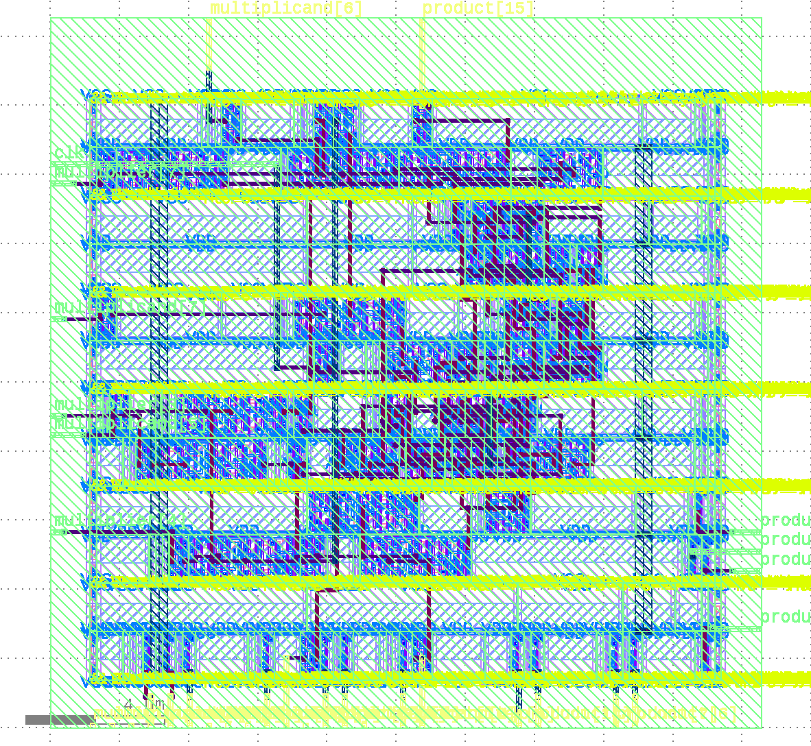

# RTLGen

This project is a Verilog generator. It takes a JSON configuration file as input and generates a Verilog module with the specified parameters. The current version of this tool only supports multiplier generation.

## Building the Project

To build the project, you will need to have CMake and a C++ compiler installed. You will also need to have the Google Test and OR-Tools libraries installed.

Once you have the dependencies installed, you can build the project with the following commands:

```
mkdir build
cd build
cmake ..
make
```

## Running the Generator

To run the generator, you will need to create a JSON configuration file. The configuration file should have the following format:

```json
{
  "operand": {
    "bit_width": 8,
    "signed": false
  },
  "multiplier": {
    "module_name": "booth4_multiplier",
    "ppg_algorithm": "Booth4",
    "compressor_structure": "AdderTree",
    "pipeline_depth": 1
  }
}
```

Once you have created the configuration file, you can run the generator with the following command:

```
./bin/mult-gen <config.json>
```

This will generate a Verilog module for a multiplier with the specified parameters. The generated module will be placed in the  execution directory.

Currently, `compressor_structure` and `pipeline_depth` are not configurable and are fixed to `AdderTree` and `1` respectively. The `ppg_algorithm` can be set to "Normal" or "Booth4" for any bit width greater than or equal to 4. The `AdderTree` is optimized using ILP as described in the paper [UFO-MAC: A Unified Framework for Optimization of High-Performance Multipliers and Multiply-Accumulators](https://arxiv.org/abs/2408.06935). For more details on the implementation and some insights, refer to the [Compressor Tree Memo](doc/compressor_tree/memo_about_compressor_tree.md).

## Implemented Algorithms

The generator supports two partial product generation (PPG) algorithms: `Normal` and `Booth4`.

- **Normal**: This is the conventional approach using a simple array of AND gates to generate partial products.
- **Booth4**: This is the radix-4 modified Booth algorithm. The Booth encoder is implemented based on the paper ["High Performance Low-Power Left-to-Right Array Multiplier Design"](https://ieeexplore.ieee.org/document/1388192).

For sign extension in both algorithms, a fast sign computation technique is used, as described in ["Minimizing Energy Dissipation in High-Speed Multipliers"](https://ieeexplore.ieee.org/document/621285).

### Validation

The generated Verilog modules are validated using a testbench that is automatically generated along with the core module. The testbench performs 100 random multiplications and verifies the results against expected values.

You can run the validation using the `run_test.sh` script located in the project root directory. The script requires a configuration file as an argument and will automatically invoke Icarus Verilog (`iverilog`) to compile and run the simulation, reporting the test results.

**Usage:**
```sh
./run_test.sh config.json
```

The generator has been tested by varying bit-widths, the signed flag, and the PPG algorithm, though more comprehensive testing is planned.

## Running the Tests

To run the tests, you can use the following command:

```
ctest
```

## Development Environment (Dev Container)

This project supports development inside a dev container, which provides a consistent Ubuntu-based environment with all necessary dependencies pre-installed. The dev container is configured for use with Visual Studio Code and Docker.

### GPU Support

If you require GPU acceleration (for example, for EDA tools or simulations), you must add the `--gpus` option to the `runArgs` in `.devcontainer/devcontainer.json`. This enables Docker to pass through GPU resources to the container.

### X11 Forwarding and ORFS

Some design flows (such as those using `/orfs/flow`) require graphical applications. To enable X11 forwarding from the container to your host, you must run the following command on your host computer before starting the container:

```
xhost + local:
```

This allows the container to connect to your host's X server for GUI applications. Without this, graphical tools inside the container (such as those in `/orfs`) will not function.

## Design Evaluation Script

The `eval_design.py` script automates the process of preparing, running, and evaluating the generated Verilog designs. It handles configuration file generation, moves design files to the appropriate platform directories, executes the flow (such as invoking `make` in `/orfs/flow`), and extracts results. Make sure to run this script inside the dev container for correct environment setup and dependency resolution.

Note that for extremely small circuits, the OpenROAD flow may fail due to the die size not satisfying the layout constraints for the power rail.

### Execution Example

To evaluate a design using the Nangate45 platform, run the following command **in the project directory**:

```
./eval_design.py config.json nangate45
```

After execution, the results for delay, power, and die size will be displayed as the bottom line of the output, for example:

```
Critical Path Delay: 0.1603
Total Power Consumption: 1.38e-05
Die Size (WxH): 41100 x 41100
Die Area: 1689210000
```

### Generated GDS2 Sample

The evaluation script generates a GDS2 file in the `results` directory. To visualize the layout, you can open the GDS2 file using [KLayout](https://www.klayout.de/) installed in the container. 

Below is a sample layout image (`sample_gds2.png`) produced by opening the GDS2 file in KLayout and exporting it as PNG. The image is located in the `materials` directory:



The GDS2 file is located at `/orfs/flow/results/nangate45/booth4_multiplier_wrapper/`, and the image was created with klayout.
