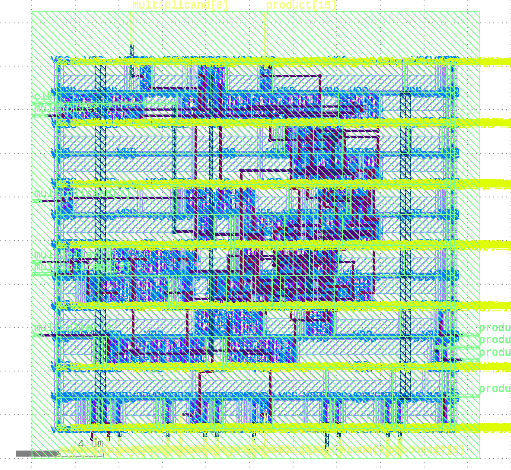

# Development Environment (Dev Container)

This project supports development inside a devcontainer, which provides a consistent Ubuntu-based environment with all necessary dependencies, including OpenROAD, pre-installed. Install Visual Studio Code and Docker on your system, then install the devcontainer plugin in Visual Studio Code. Building the development environment takes a long time because it downloads the OpenROAD source files and related libraries and builds them. For best results, use a broadband network connection.

## X11 Forwarding and ORFS

Some design flows (such as those using `/orfs/flow`) require graphical applications. To enable X11 forwarding from the container to your host, run the following command on your host computer before starting the container:

```
xhost + local:
```

This allows the container to connect to your host's X server for GUI applications. Without this, graphical tools inside the container (such as those in `/orfs`) will not function.

## Old Evaluation Script

The `scripts/execute_evaluation.py` script automates the process of evaluating generated Verilog designs. It prepares the necessary files, runs the complete OpenROAD flow, and extracts key metrics such as delay, power, and area.

**Usage:**
```sh
python3 scripts/execute_evaluation.py <config.json> <platform>
```
- `<config.json>`: Path to your multiplier configuration file.
- `<platform>`: Target platform (e.g., `sky130hd`, `nangate45`, or `asap7`).

The script will generate the design, run the flow, and print the results to the console. Output files and logs are placed in the appropriate results directory.

## New Evaluation Scripts

`scripts/generate_design.py` generates Verilog files and the required configuration files for OpenROAD execution, then places them in `/orfs/flow/design`.

**Usage:**
```sh
python3 scripts/generate_design.py <config.json> <platform> [--optimization_target <target>] [--core_utilization_min <min>] [--core_utilization_max <max>] [--place_density_min <min>] [--place_density_max <max>] [--clock_period_min <min>] [--clock_period_max <max>] [--force_gen]
```
- `<config.json>`: Path to your multiplier configuration file.
- `<platform>`: Target platform (e.g., `sky130hd`, `nangate45`, `asap7`).
- Optional arguments allow you to specify optimization targets and flow parameters.

This script prepares all necessary files for OpenROAD, enabling you to run the flow manually or as part of a larger automated process. You can execute the OpenROAD flow by specifying `/orfs/flow/designs/<platform>/<module name>_wrapper/config.mk`. If you have set up AutoTuner (see below), you can use `scripts/run_autotuner.py` to automatically search for the optimal result in terms of weighted PPA metrics.

**Usage:**
```sh
python3 scripts/run_autotuner.py --design <design_name> --platform <platform> [--step <step>] [--output_csv <path>] [--no_output_csv]
```
- `--design <design_name>`: Name of the design (e.g., `<module name>_wrapper`).
- `--platform <platform>`: Target platform (e.g., `sky130hd`, `nangate45`, `asap7`).
- `--step <step>`: Step value for PPA coefficient combinations (default: 0.25).
- `--output_csv <path>`: Path to save the evaluation results in CSV format (default: `<design_name>.csv`).
- `--no_output_csv`: Disable saving results to a CSV file.

This script wraps the openroad_autotuner, automatically generates and updates the config path, and runs an evaluation sweep to find the best trade-off between performance, power, and area.

## AutoTuner

The AutoTuner is automatically installed in the devcontainer as part of the environment setup. However, please note that the current `distribute.py` and `utils.py` in `orfs/tools/AutoTuner/src/autotuner` have some bugs affecting the tuning operation. Bug fixes for these issues are available in my branch:

[https://github.com/yhmtmt/orfs.git](https://github.com/yhmtmt/orfs.git)

A brief description of the bugfixes is provided in the commit messages of that repository. If you wish to use the fixed version, pull my repository above into `/orfs` in the devcontainer:

```
cd /orfs
git pull https://github.com/yhmtmt/orfs.git
```

The usage of the AutoTuner remains the same as described in the ORFS manual. Please be aware that further revisions may be necessary for full functionality. (One notable issue is that it cannot properly evaluate weighted PPA (Performance, Power, Area) metrics.)

## Generated GDS2 Sample

The evaluation script generates a GDS2 file in the `results` directory. To visualize the layout, you can open the GDS2 file using [KLayout](https://www.klayout.de/) installed in the container.

Below is a sample layout image (`sample_gds2.png`) produced by opening the GDS2 file in KLayout and exporting it as PNG. The image is located in the `materials` directory:



The GDS2 file is located at `/orfs/flow/results/nangate45/booth4_multiplier_wrapper/`, and the image was created with KLayout.

