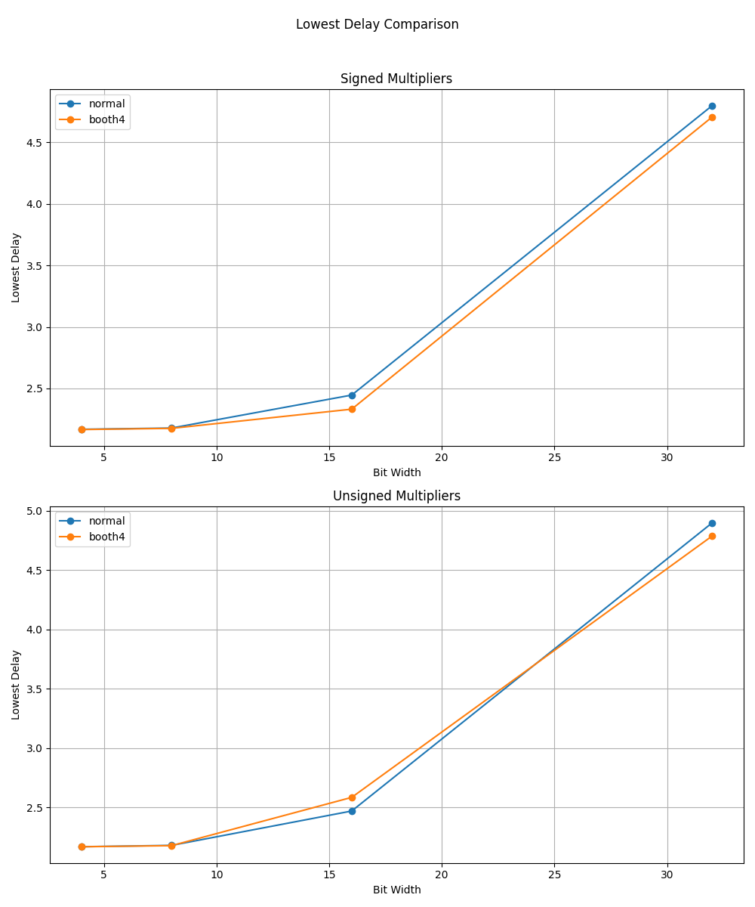
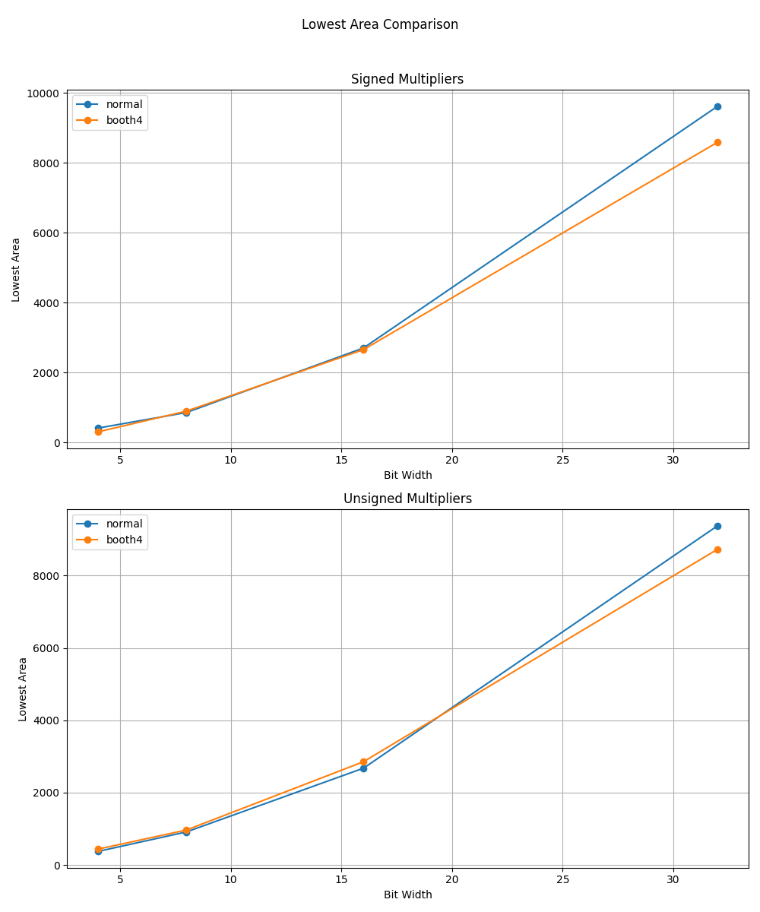

# Comparison of Modified Booth and Normal Multipliers

Multiplication has long dominated computation time, initially in signal processing and now in neural computation. The Multiply-Accumulate (MAC) unit is a fundamental component of DSPs, GPUs, and NPUs.

For unsigned integer multiplication, there are three primary components: a partial product generator, a compressor tree, and a carry-propagating adder. This document focuses on partial product generation. While numerous papers have been published on multipliers, a crucial design choice in the partial product generator is Booth's algorithm [1].

## Booth's Algorithm

Booth's algorithm is a technique that skips partial product computations when continuous ones appear in the multiplier. This technique is effective when variable completion timing is permissible. However, modern synchronously clocked processing units require constant computation time. The Modified Booth algorithm [2] was introduced to ensure a constant completion time while reducing the number of partial products by half compared to normal multiplication. A proof of this is provided in [3]. The algorithm examines three bits of the multiplier to generate a single row of the partial product, and the multiplier is shifted by 2 bits for each partial product generation. By using 3 bits, compared to simply computing a radix-4 partial product using 2 bits of the multiplier, this technique can avoid a 3x multiplication. It replaces 3x, 2x, 1x, and 0x operations with +/- 2x, 1x, and 0x operations. Since a 2x operation can be implemented with only a shift, the modified Booth algorithm can halve the number of partial product computations without any addition operations. Consequently, the modified Booth algorithm and its higher-radix variants have been frequently used, especially in high-performance microprocessors.

It has been widely believed that the modified Booth algorithm offers better performance and area efficiency because it halves the number of partial products. Therefore, it has been a popular choice for high-performance processors. However, since the 1990s, it has been suggested that the modified Booth algorithm leads to higher power consumption due to glitches caused by the recoder circuits [4]. Numerous papers have addressed this glitch problem, even in recent years [5, 6].

On the other hand, although not as frequently mentioned, [7] demonstrated that non-Booth multipliers with carefully designed compressor trees can outperform modified Booth multipliers. Furthermore, [8] reported that the modified Booth algorithm can be slower because the Booth recoder can be slower than a single-stage 4:2 compressor. A stage of 4:2 compressors halves the number of partial product rows, similar to the Booth recoder.

Subsequently, many papers have been published, but I have not found any that directly compare modified Booth multipliers with normal ones. I have also not seen evaluation results with swept parameters; only results from specific designs have been presented.

## Evaluation

In this work, I implemented both a modified Booth and a normal partial product generator [10] and compared them using OpenROAD with the Nangate45 PDK. I implemented the sign computation technique and the Booth recoder circuit from [4]. The compressor tree, which reduces the partial products to two rows, is generated using the ILP-based method described in [9]. The final two rows are summed by a Ripple-Carry Adder (RCA).

OpenROAD was executed via an autotuner to optimize a weighted PPA (Power, Performance, and Area) metric. I slightly modified the autotuner code in the OpenROAD flow scripts and prepared some evaluation scripts. The modified version of the OpenROAD flow scripts is available on my GitHub [11]. The multipliers were generated and evaluated using `generate_multiplier_configs.py`, `generate_multipliers.py`, and `execute_evaluation.py`. The multipliers range from 4 to 32 bits, are both signed and unsigned, and use either radix-4 modified Booth or normal partial product generators. (For the radix-4 Booth, we can generate 64-bit multipliers, but this is not feasible for the normal multiplier due to a slow ILP solver.)

I have now obtained the results for the smallest delay and area. (I also have power optimization results, but they do not account for glitch activity, which is why I am not discussing them here.)

## Results

### Delay Comparison

### Area Comparison

The results show that in terms of both performance and area, the two algorithms show quite similar results. There is no obvious benefit to using the modified Booth algorithm, especially if the glitching problem is taken into account. Since we used an RCA for the final stage, most of the delay could be attributed to the carry chain at the bottom. If so, we would expect to see a wider gap between the two algorithms for smaller bit widths, but the data does not support this.

This evaluation is preliminary, and there are several possibilities that could change the results. For example, the results are from a limited number of explorations, and I am not confident that I have found the true optimal point for the designs. Moreover, we can further optimize the circuit in RTL, for example, by introducing optimized carry-propagation adders as in [12]. Such optimizations could also change the results.

## References

[1] A. D. Booth, "A Signed Binary Multiplication Technique," The Quarterly Journal of Mechanics and Applied Mathematics, Volume 4, Issue 2, pp.236–240, 1951.

[2] O. L. Macsorley, "High-Speed Arithmetic in Binary Computers," in Proceedings of the IRE, vol. 49, no. 1, pp. 67-91, Jan. 1961.

[3] L. P. Rubinfield, "A Proof of the Modified Booth's Algorithm for Multiplication," in IEEE Transactions on Computers, vol. C-24, no. 10, pp. 1014-1015, Oct. 1975.

[4] R. Fried, "Minimizing energy dissipation in high-speed multipliers," Proceedings of 1997 International Symposium on Low Power Electronics and Design, pp. 214-219, Monterey, CA, USA, 1997.

[5] A. C. Ranasinghe and S. H. Gerez, "Glitch-Optimized Circuit Blocks for Low-Power High-Performance Booth Multipliers," in IEEE Transactions on Very Large Scale Integration (VLSI) Systems, vol. 28, no. 9, pp. 2028-2041, Sept. 2020

[6] Y. -J. Chang, Y. -C. Cheng, S. -C. Liao and C. -H. Hsiao, "A Low Power Radix-4 Booth Multiplier With Pre-Encoded Mechanism," in IEEE Access, vol. 8, pp. 114842-114853, 2020

[7] P. J. Song and G. De Micheli, "Circuit and architecture trade-offs for high-speed multiplication," in IEEE Journal of Solid-State Circuits, vol. 26, no. 9, pp. 1184-1198, Sept. 1991.

[8] P. Bonatto and V. G. Oklobdzija, "Evaluation of Booth's algorithm for implementation in parallel multipliers," Conference Record of The Twenty-Ninth Asilomar Conference on Signals, Systems and Computers, vol.1, pp. 608-610, Pacific Grove, CA, USA, 1995.

[9] D. Zuo, J. Zhu, C. Li and Y. Ma, "UFO-MAC: A Unified Framework for Optimization of High-Performance Multipliers and Multiply-Accumulators," 2024 ACM/IEEE International Conference On Computer Aided Design (ICCAD), pp. 1-9, Newark, NJ, USA, 2024.

[10] https://github.com/yhmtmt/RTLGen.git (this repo)

[11] https://github.com/yhmtmt/orfs.git

[12] R. Roy et al., "PrefixRL: Optimization of Parallel Prefix Circuits using Deep Reinforcement Learning," 2021 58th ACM/IEEE Design Automation Conference (DAC), pp. 853-858, San Francisco, CA, USA, 2021.