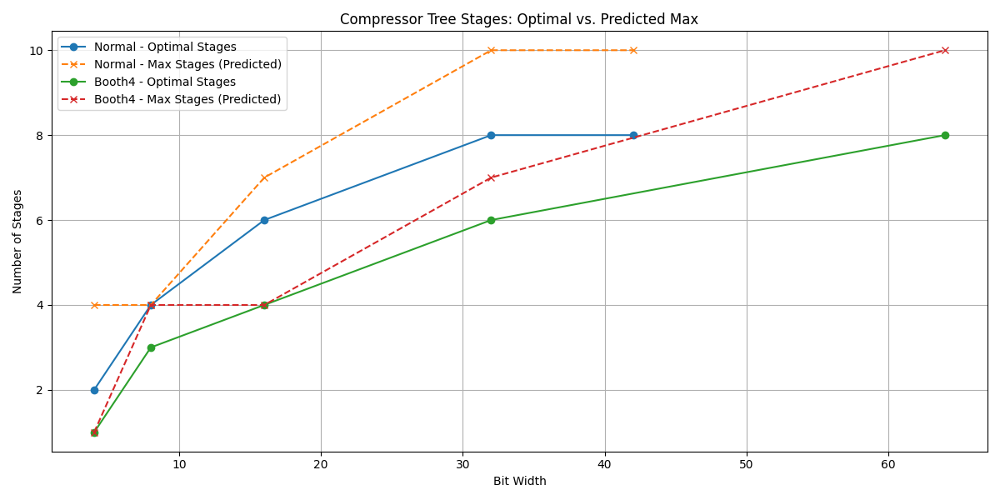

# Memo about Compressor Tree Optimization

The implementation of the compressor tree optimization is based on UFO-MAC [1]. I attempted to implement the entire algorithm, but the part successfully integrated here is limited to counting and assigning full and half adders. Other parts, such as interconnect assignment and prefix adder optimization, were not implemented due to perceived issues in their formulation. Before explaining these problems, I should describe a subtle mistake in the ILP formulation for adder assignment that I encountered and corrected.

## Recent ILP changes and evaluation provenance

Two implementation differences matter for multiplier results and should be tracked in evaluations:

- **Compressor library selection.** The current ILP can be configured to allow only 3:2/2:2 compressors (`compressor_library = "fa_ha"`) or also allow 4:2 compressors (`compressor_library = "fa_ha_c42"`). This selection changes the feasible solution space and therefore the optimal stage count and structure.
- **Objective sequencing vs. precomputed counts.** The previous implementation precomputed fixed per-column counts of full/half adders and then solved for stage placement. The current implementation directly assigns compressors and minimizes stage count as the primary objective, with compressor count as a secondary objective. As a result, even the 3:2/2:2-only solutions can differ from the previous implementation.

Because of these changes, multiplier evaluation data produced before the compressor-library option was introduced must be treated as **pre-change results** and should not be mixed with new evaluations. In reports and plots, explicitly note that "previous multiplier evaluations used the prior FA/HA-count-based ILP implementation."

## Evaluation plan (post-change)

1. **Baseline re-run (fa_ha only).** Re-run the full multiplier campaigns with `compressor_library = "fa_ha"` to establish a new baseline with the current ILP formulation while keeping the compressor set identical to the legacy flow.
2. **Compare to prior results.** Compare the new baseline against the previous campaign outputs (tagged as pre-change). Record deltas in area/timing/power and note any regressions or improvements.
3. **4:2 mix evaluation.** Run the same campaigns with `compressor_library = "fa_ha_c42"` and compare against the new baseline.
4. **Documentation refresh.** If the 4:2 mix results are equal or better, update multiplier documentation and plots to the new baseline, and clearly annotate the methodology and compressor-library setting used.

## Baseline check (fa_ha)

The baseline `fa_ha` sweeps (4/8/16/32-bit, signed+unsigned, PPG/CPA grid) reproduce the exact same HDL and PPA as the pre-change multipliers; all deltas vs the prior summaries are zero. High-utilization runs were not re-executed yet. This confirms that the new compressor-library selector preserves the previous design for the `fa_ha` setting when using the legacy FA/HA-count-based assignment.

## 4:2 mix evaluation note

The current 4:2 compressor is implemented as two cascaded 3:2 compressors. Treating it as a single-stage element in the ILP can over-emphasize 4:2 usage because the objective minimizes stage count, even though the internal critical path may traverse two 3:2 levels. This means stage count alone may not correlate with actual delay unless a hardened macro or timing model is introduced. Keep this in mind when interpreting 4:2 mix results.

## Direct ILP limitation (current)

The direct compressor-assignment ILP fails to find solutions for 16-bit and wider multipliers (even without 4:2 enabled). As a result, practical evaluations must continue to use the legacy FA/HA-count-based ILP (`compressor_assignment = "legacy_fa_ha"`) until the direct solver is fixed. Any results produced with `compressor_assignment = "direct_ilp"` should be labeled as 8-bit-only and not compared to the legacy baselines without this caveat.

*   **My modification in adder assignment.**

    Equation (8) in paper [1] describes the constraint of the number of partial products (PPs) in the $i$-th stage's $j$-th column as follows:

    )

    Where $f_{i,j}$ and $h_{i,j}$ denote the number of full and half adders in the $i$-th stage's $j$-th column. The last two terms describe the carry bits from the $(i-1)$-th stage's $(j-1)$-th column. The first three terms describe sum output bits from the $(i-1)$-th stage's $j$-th column. Therefore, the equation should correctly be:

    

    My code was implemented with the corrected equation above.

    Moreover, to accelerate convergence, the number of variables in the problem should be minimized. There is an important bound, `stage_max`, which appears in equations (6) and (7):

    )

    )

    Where $F_j$ and $H_j$ are constants calculated preliminarily. `stage_max` should be at least greater than or equal to the optimal value. If we can select a value for `stage_max` that is close to the optimal value, the optimization time can also be minimized.

    Paper [1] does not provide the exact value for `stage_max`. In my implementation, I set the value of `stage_max` as follows:

    %20%5Crceil}/2%20%5Crceil))

    This represents an upper bound, assuming an infinite number of columns in the partial product array. Considering a middle column in an infinite PP array, where the previous column produces carries identical to the column of interest, we can reduce the PPs in the column by 2/3 per stage using full adders. The solution must be an integer. The bound assumes that `pp_rows` is the nearest larger integer power of 3, and the stages where the number of PPs is reduced to two are rounded up. This might seem like a pessimistic bound, but you can observe that the value is quite close.  

    

    The graph concerns the number of compressor tree stages for Normal and Booth4 multipliers. The optimal values and maximum values expected by the equation above are close. I doubt if there is a more straightforward assignment algorithm.

*   **Is the interconnection assignment formulation really ILP?**

    The author formulated interconnect assignment as optimizing permutation matrices. In each stage, arbitrary wire swapping is feasible in terms of functionality. This is formulated as a 2-D matrix with only one '1' in each column and row. Equation (21) expresses this constraint. However, equation (20) further restricts this, allowing only diagonal elements to be '1'. Therefore, the only possible solution is an identity matrix. Even if we remove this constraint, the approach might not be an ILP formulation because the final optimization target is maximum delay. We would need to multiply the permutation matrix by the input delay vector to compute the output delay vector in each stage. Delay vectors accumulate through the stages, and the optimization target is the maximum value of the final output delay vector, as described in equations (22) and (23). However, the authors did not show any equation accumulating delays through compressor trees. This operation obviously includes multiplications of delay vectors and permutation matrices, both of which are variables. This cannot be fed into an ILP solver. That is why I did not implement the interconnection swapping.

*   **What does the prefix graph optimization do?**

    The `GraphOpt` procedure in Algorithm 2 simply does not work for both depth and fanout optimizations. Additionally, the fanout optimization example in Figure 9 shows an increase in the fanout of input nodes, which I cannot understand the meaning of. Prefix graph optimization is a well-studied topic and is not a trivial problem. Thus, I did not implement the prefix graph optimization algorithm presented in the paper. (My current implementation is merely a ripple carry adder.) I am planning to implement different ones from older works.

## References

[1] UFO-MAC: A Unified Framework for Optimization of High-Performance Multipliers and Multiply-Accumulators.
