# Yosys Booth vs ILP Booth Multipliers

This note compares the current RTLGen ILP-based Booth4 multiplier against Yosys's Booth and LowpowerBooth implementations. The comparison is done using OpenROAD sweeps across Nangate45, Sky130HD, and ASAP7 for widths 4/8/16/32 and both signed/unsigned cases (LowpowerBooth is signed-only).

## Implementations

### RTLGen ILP-based multiplier (this repo)
- Partial product generator: Normal or Booth4 (radix-4).
- Compressor tree: ILP-optimized adder tree using OR-Tools; 3:2 and 2:2 compressors only. Details in `doc/compressor_tree/memo_about_compressor_tree.md`.
- Carry-propagate adder: Ripple, BrentKung, KoggeStone, or Sklansky.
- Pipeline depth: fixed to 1.
- Sign extension: uses the fast method described in Fried (1997), integrated in the generator.

### Yosys Booth multiplier (baseline)
- RTLGen emits a simple `product = multiplicand * multiplier` Verilog module.
- Yosys is then invoked with `booth` or `booth -lowpower`, followed by `techmap`, to produce a Booth-style implementation.
- LowpowerBooth is only valid for signed operands (enforced in `build_yosys`).
- The Yosys manual attributes `booth -lowpower` to the pre-encoded low-power radix-4 Booth mechanism from Chang et al. (2020). A local copy of the paper is kept under `papers/` (gitignored).

## Evaluation setup
- ILP runs are from `runs/campaigns/multipliers/ppg_cpa_widths_4_32`.
- Yosys runs are from `runs/campaigns/multipliers/yosys_booth_widths_4_32`.
- Normalization script: `analysis/compare_yosys_vs_ilp_booth.py`.
- Area normalization uses `best_area_highutil.csv` (dense floorplans).
- Delay and power normalization use `best_delay_all.csv` and `best_power_all.csv` (best across utilization points).

In the plots below, values are normalized as (ILP / Yosys). Values below 1.0 favor ILP; values above 1.0 favor Yosys.

## Summary plots (ILP over Yosys)

These plots focus on signed Booth (most representative in the sweep). The full plot set (including unsigned and LowpowerBooth) is in the appendix.

### Nangate45 — Booth (signed)
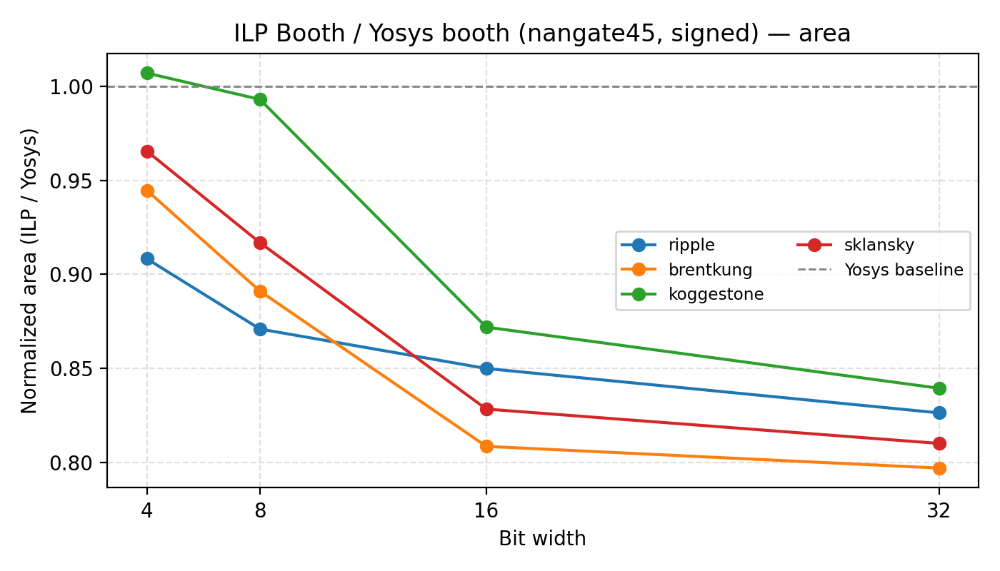
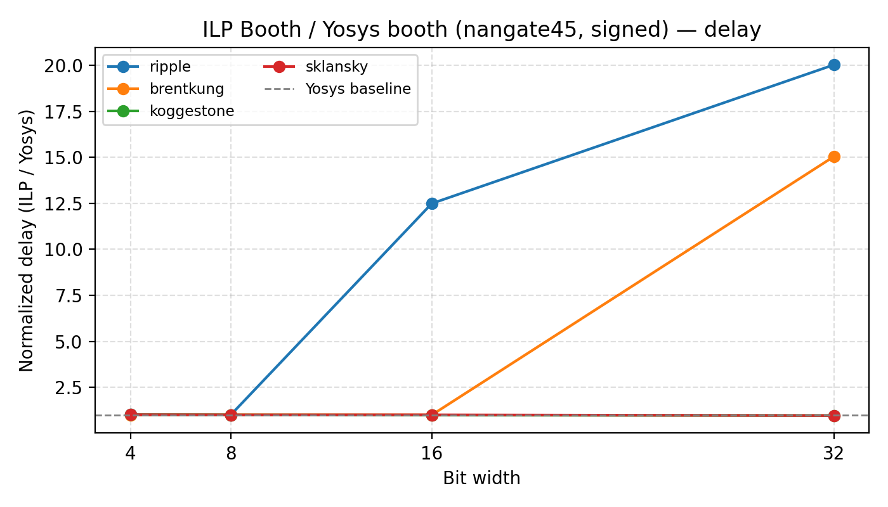
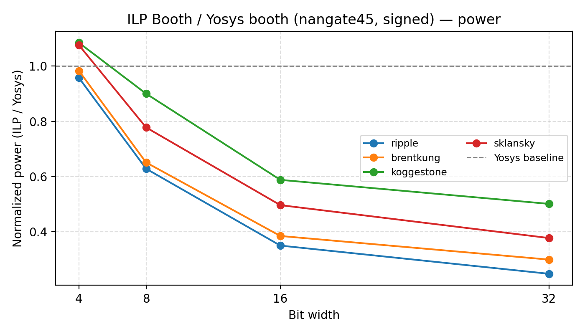

### Sky130HD — Booth (signed)
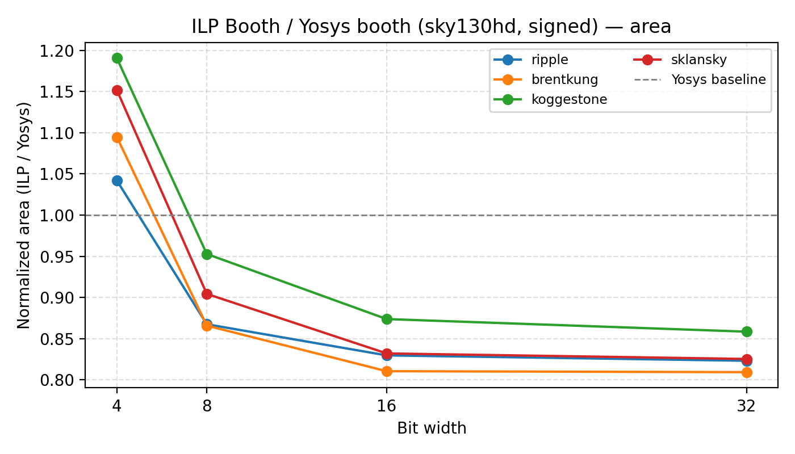
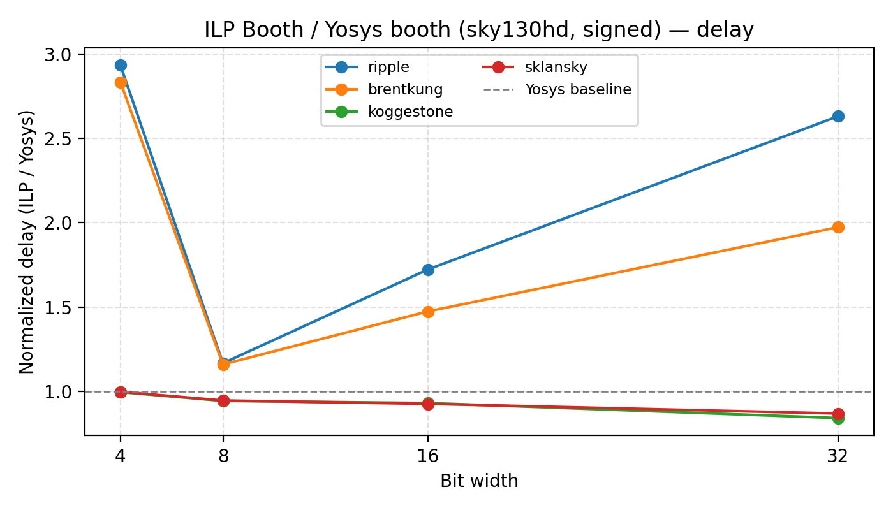

### ASAP7 — Booth (signed)

## Timing best/worst per PDK (normalized delay)

Values are ILP/Yosys delay ratios across all widths and CPAs. Best < 1.0 means ILP is faster than Yosys.

| PDK | Booth best (signed/unsigned) | Booth worst (signed/unsigned) | LowpowerBooth best (signed) | LowpowerBooth worst (signed) |
| --- | --- | --- | --- | --- |
| Nangate45 | 0.96 (mult32s_booth4_sklansky_wrapper, w32) | 20.41 (mult32u_booth4_ripple_wrapper, w32) | 0.04 (mult32s_booth4_sklansky_wrapper, w32) | 1.01 (mult4s_booth4_koggestone_wrapper, w4) |
| Sky130HD | 0.84 (mult32s_booth4_koggestone_wrapper, w32) | 3.31 (mult4u_booth4_ripple_wrapper, w4) | 0.23 (mult32s_booth4_koggestone_wrapper, w32) | 1.01 (mult4s_booth4_ripple_wrapper, w4) |
| ASAP7 | 0.80 (mult16s_booth4_koggestone_wrapper, w16) | 2.51 (mult32u_booth4_ripple_wrapper, w32) | 0.29 (mult32s_booth4_koggestone_wrapper, w32) | 1.01 (mult4s_booth4_brentkung_wrapper, w4) |

The large worst-case ratios come from comparing Yosys Booth against ILP ripple-style CPAs; they are expected when the CPA dominates delay.

## Appendix: full plot set

### Nangate45 — Booth (unsigned)

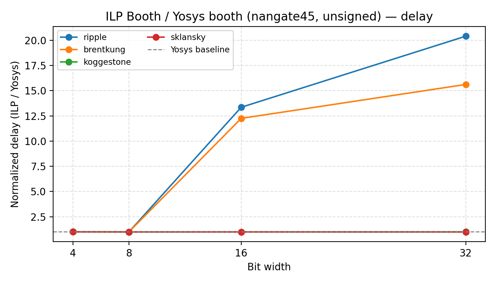

### Nangate45 — LowpowerBooth (signed)

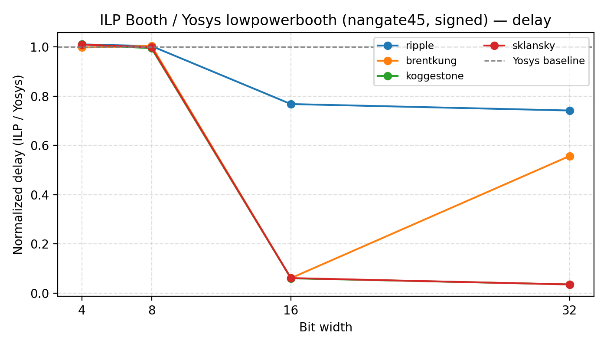

### Sky130HD — Booth (unsigned)

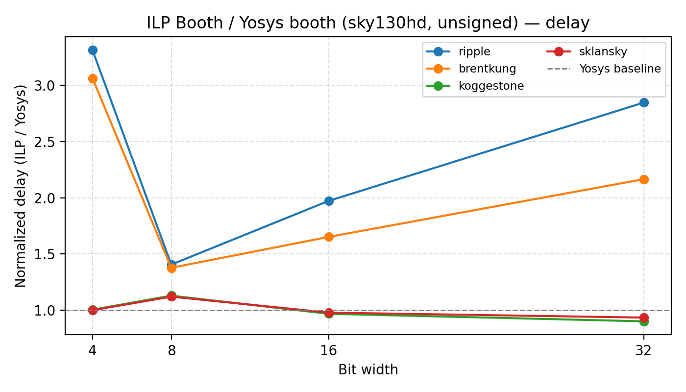
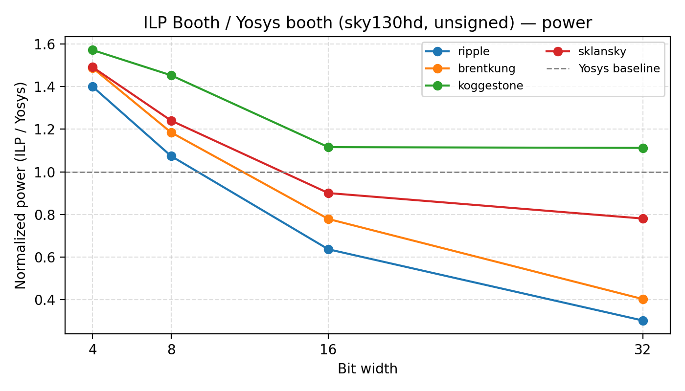

### Sky130HD — LowpowerBooth (signed)

### ASAP7 — Booth (unsigned)
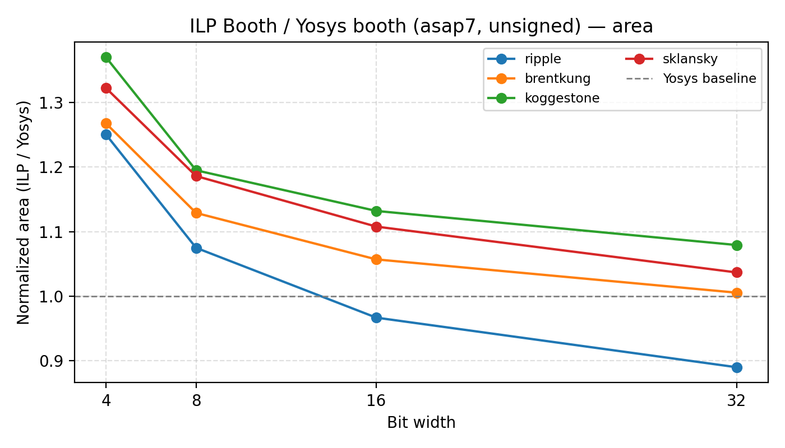
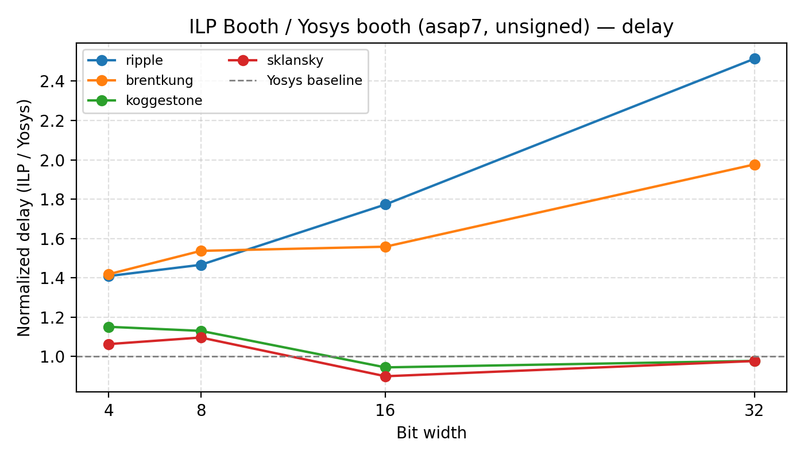
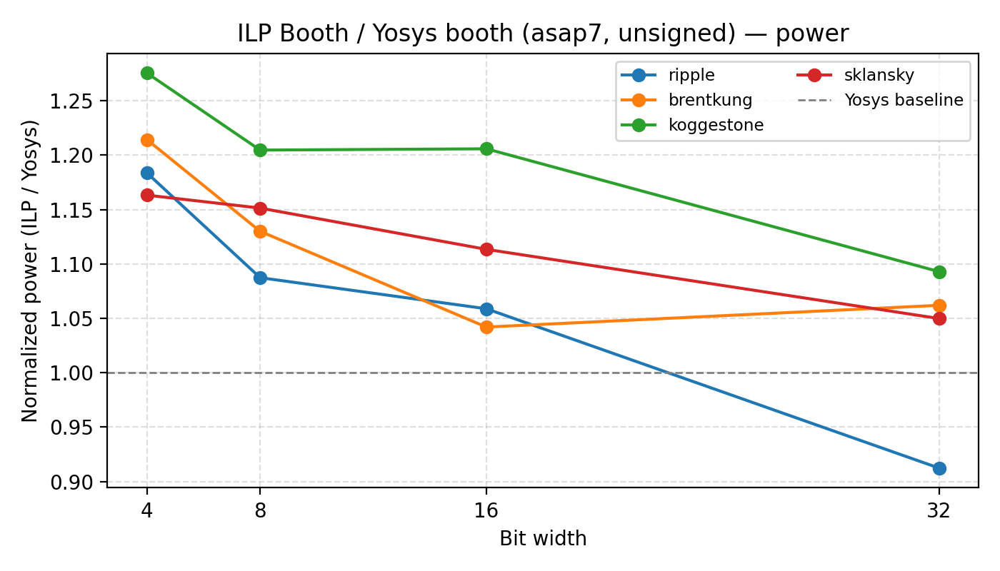

### ASAP7 — LowpowerBooth (signed)
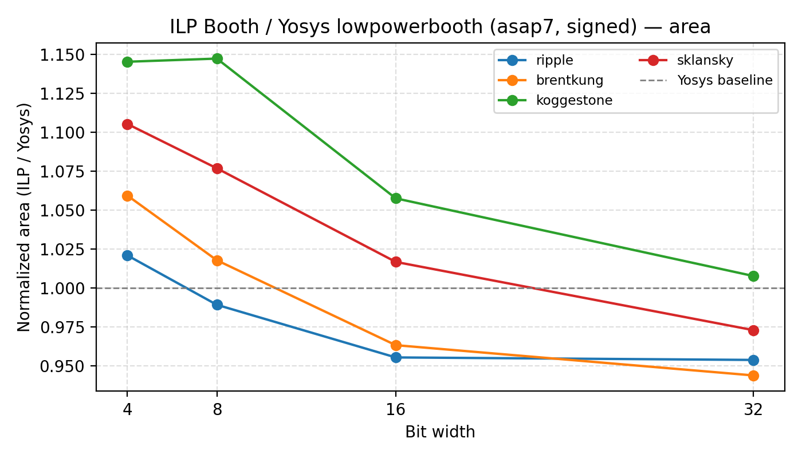

## Results and interpretation
- ILP prefix CPAs (KoggeStone/Sklansky) generally beat Yosys Booth on delay across all three PDKs; area is often close on some wide signed Nangate45 cases.
- Yosys LowpowerBooth tends to lag in delay; ILP Ripple/BrentKung generally land faster with similar or smaller area.
- ASAP7 shows the largest ILP advantage across delay and power; Nangate45/Sky130HD are closer on area but still favor ILP for timing.
- Power numbers come from OpenROAD reports (no glitch modeling), so treat power deltas as relative indicators.
- The ASAP7 area penalty for Yosys LowpowerBooth is not explained by signedness (all LowpowerBooth cases are signed). It is more likely due to the extra pre-encoding/gating logic interacting poorly with the ASAP7 cell library and routing density, plus timing-driven upsizing to meet the clock.

## ILP Normal vs Yosys LowpowerBooth (signed only)

To test the hypothesis that lowpower Booth savings trade off against delay/area, we compare ILP Normal (PPG=Normal, signed) against Yosys LowpowerBooth (signed). Ratios are ILP Normal / Yosys LowpowerBooth.

### Normalized plots (ILP Normal / Yosys LowpowerBooth)

#### Nangate45

#### Sky130HD
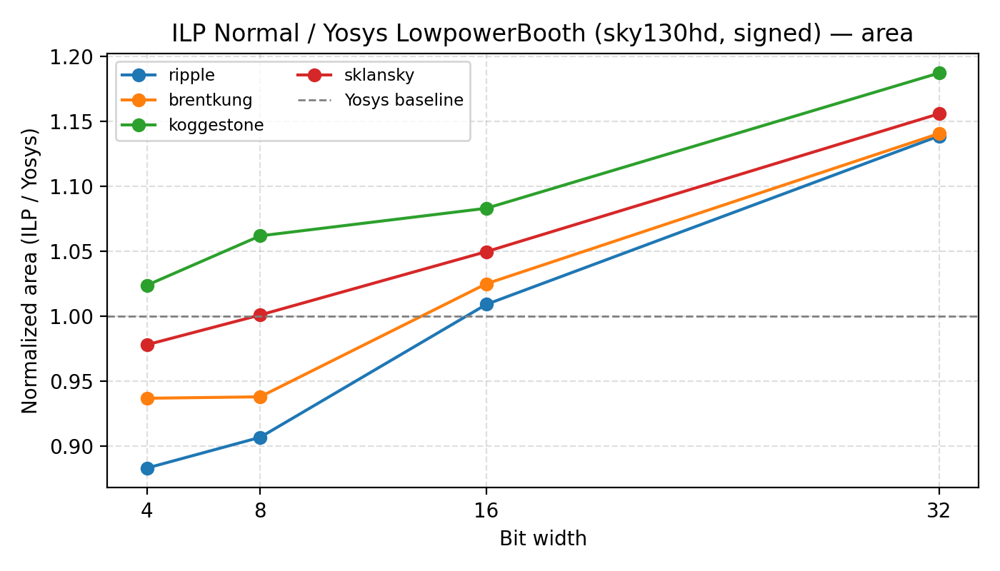
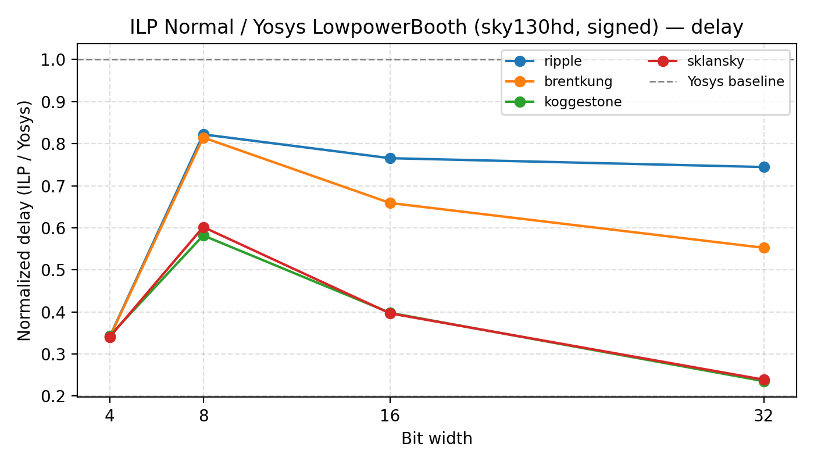

#### ASAP7

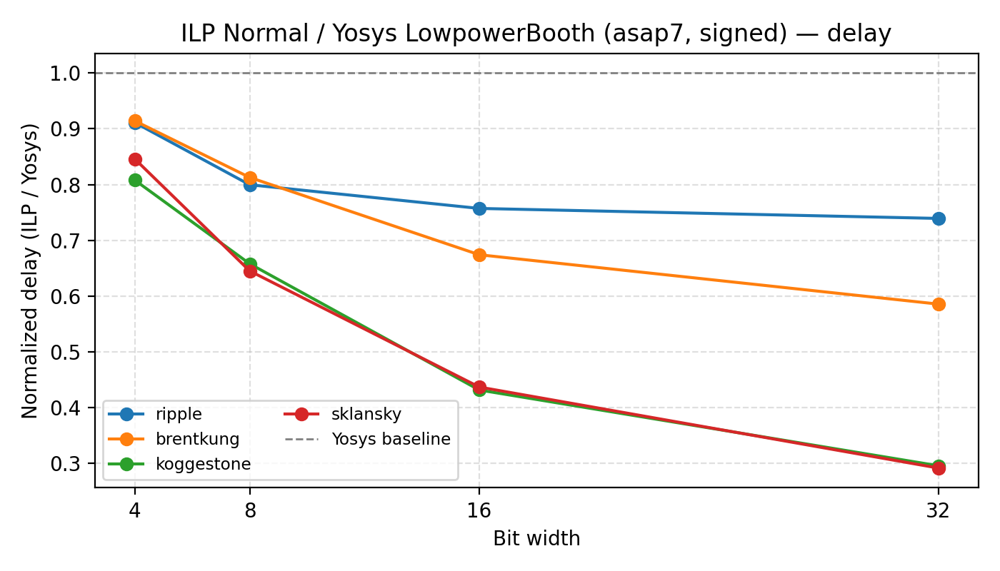

| PDK | Delay best/median/worst | Area best/median/worst | Power best/median/worst |
| --- | --- | --- | --- |
| Nangate45 | 0.04 / 0.89 / 1.02 | 0.94 / 1.05 / 1.17 | 0.06 / 0.61 / 1.31 |
| Sky130HD | 0.24 / 0.48 / 0.82 | 0.88 / 1.02 / 1.19 | 0.10 / 0.63 / 1.13 |
| ASAP7 | 0.29 / 0.71 / 0.91 | 0.87 / 0.91 / 1.00 | 0.91 / 0.99 / 1.19 |

Interpretation:
- Delay: ILP Normal is usually faster (median < 1.0 across all PDKs), especially on larger widths with prefix CPAs.
- Area: ILP Normal is comparable, sometimes smaller (best < 1.0) and sometimes modestly larger (worst ~1.1-1.2).
- Power: results are mixed because OpenROAD power does not model recoder glitches; the low-power architecture does not receive its intended advantage here.

Given these results, the lowpower Booth option does not outperform ILP Normal in delay/area for these sweeps. Even if the Chang et al. mechanism reduces recoder glitches, it likely pays with extra logic depth and wiring, so its benefits show up only under activity-aware power analysis, not in the PPA metrics we are currently extracting.

## References
- Implementation details for compressor trees: `doc/compressor_tree/memo_about_compressor_tree.md`.
- Sweep results and configs: `runs/campaigns/multipliers/ppg_cpa_widths_4_32/` and `runs/campaigns/multipliers/yosys_booth_widths_4_32/`.
- Plot generator: `analysis/compare_yosys_vs_ilp_booth.py`.
- Y. J. Chang, Y. C. Cheng, S. C. Liao and C. H. Hsiao, "A Low Power Radix-4 Booth Multiplier With Pre-Encoded Mechanism," IEEE Access, vol. 8, pp. 114842-114853, 2020. (Local PDF in `papers/`, gitignored.)
