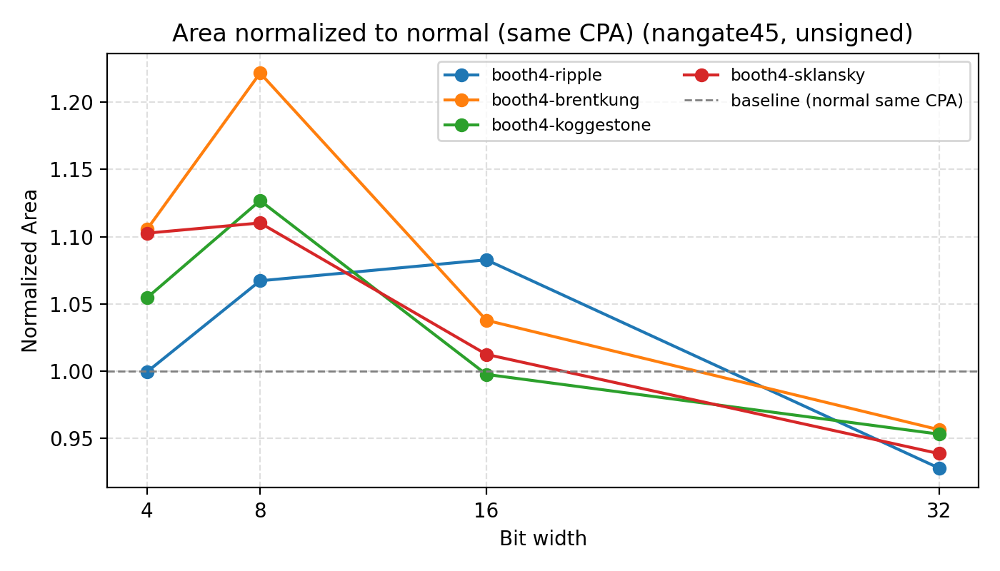
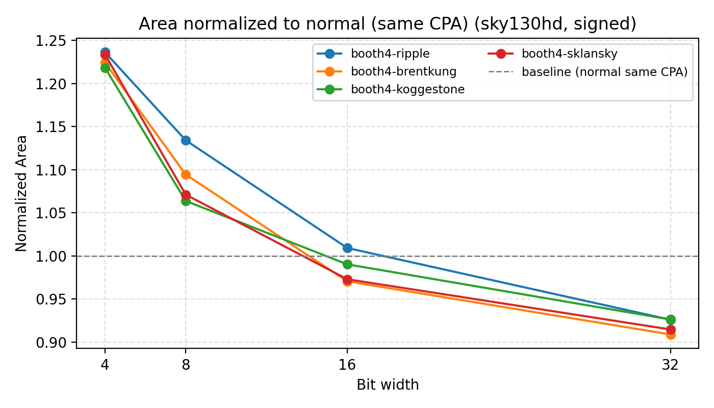
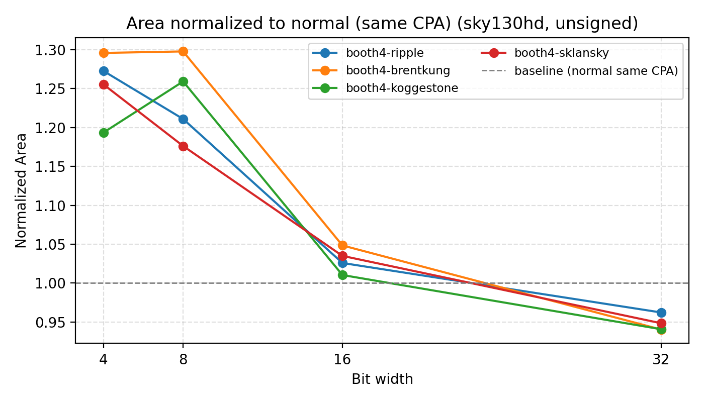
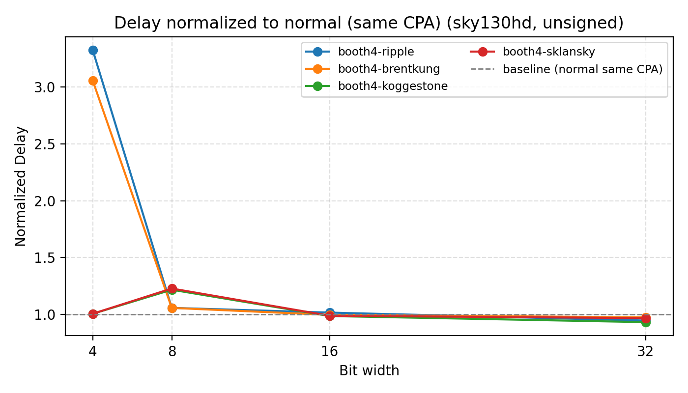
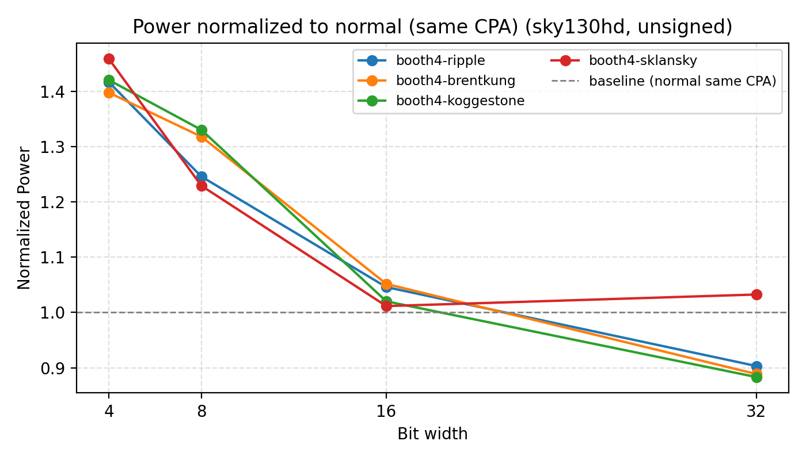
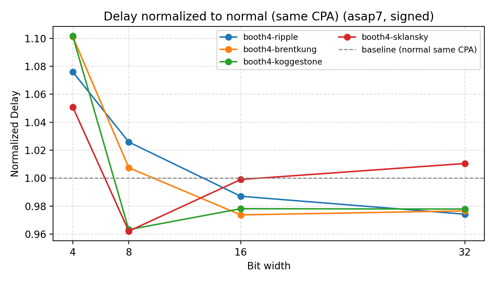
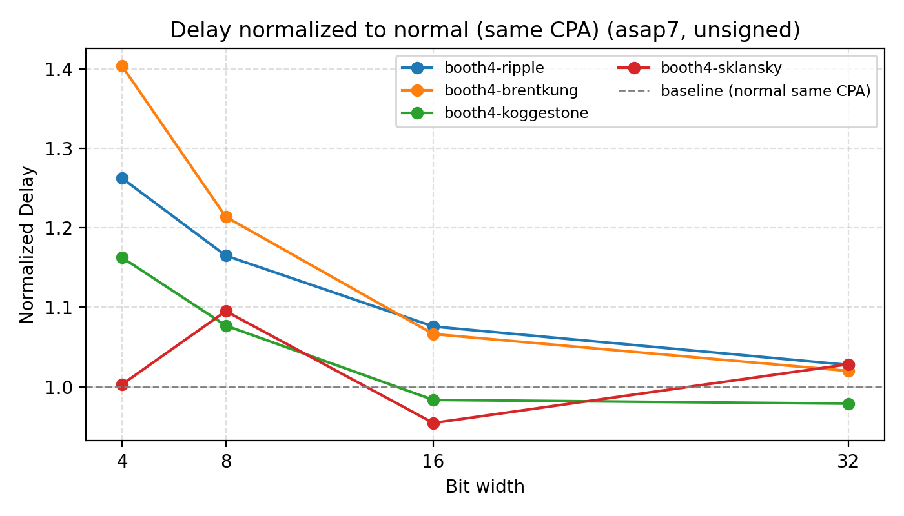

# Comparison of Modified Booth and Normal Multipliers

Multiplication has long dominated computation time, initially in signal processing and now in neural computation. The Multiply-Accumulate (MAC) unit is a fundamental component of DSPs, GPUs, and NPUs.

For unsigned integer multiplication, there are three primary components: a partial product generator, a compressor tree, and a carry-propagating adder. This document focuses on partial product generation. While numerous papers have been published on multipliers, a crucial design choice in the partial product generator is Booth's algorithm [1].

## Booth's Algorithm

Booth's algorithm is a technique that skips partial product computations when continuous ones appear in the multiplier. This technique is effective when variable completion timing is permissible. However, modern synchronously clocked processing units require constant computation time. The Modified Booth algorithm [2] was introduced to ensure a constant completion time while reducing the number of partial products by half compared to normal multiplication. A proof of this is provided in [3]. The algorithm examines three bits of the multiplier to generate a single row of the partial product, and the multiplier is shifted by 2 bits for each partial product generation. By using 3 bits, compared to simply computing a radix-4 partial product using 2 bits of the multiplier, this technique can avoid a 3x multiplication. It replaces 3x, 2x, 1x, and 0x operations with +/- 2x, 1x, and 0x operations. Since a 2x operation can be implemented with only a shift, the modified Booth algorithm can halve the number of partial product computations without any addition operations. Consequently, the modified Booth algorithm and its higher-radix variants have been frequently used, especially in high-performance microprocessors.

It has been widely believed that the modified Booth algorithm offers better performance and area efficiency because it halves the number of partial products. Therefore, it has been a popular choice for high-performance processors. However, since the 1990s, it has been suggested that the modified Booth algorithm leads to higher power consumption due to glitches caused by the recoder circuits [4]. Numerous papers have addressed this glitch problem, even in recent years [5, 6].

On the other hand, although not as frequently mentioned, [7] demonstrated that non-Booth multipliers with carefully designed compressor trees can outperform modified Booth multipliers. Furthermore, [8] reported that the modified Booth algorithm can be slower because the Booth recoder can be slower than a single-stage 4:2 compressor. A stage of 4:2 compressors halves the number of partial product rows, similar to the Booth recoder.

Subsequently, many papers have been published, but I have not found any that directly compare modified Booth multipliers with normal ones. I have also not seen evaluation results with swept parameters; only results from specific designs have been presented.

## Evaluation

We implemented both a modified Booth and a normal partial product generator [10] and swept them with OpenROAD across three PDKs (Nangate45, Sky130HD, ASAP7). Each design uses an ILP-generated compressor tree [9] and a carry-propagate adder (CPA) chosen from Ripple, Brent-Kung, Kogge-Stone, or Sklansky. Signed/unsigned variants and widths 4/8/16/32 are covered. Synthesis/PnR runs include low-util and high-util floorplans; summaries live under `runs/campaigns/multipliers/ppg_cpa_widths_4_32/` (best area/delay/power tables).

Power numbers come from OpenROAD reports (no glitch modeling), so treat them as relative.

## Results

### PPA takeaways across CPAs and PDKs
- CPA choice dominates timing/area. Kogge-Stone and Sklansky are consistently fastest and largest; Ripple is smallest and slowest; Brent-Kung sits in between. This ordering holds for both Booth4 and Normal PPGs.
- Booth vs Normal is platform-dependent and modest: Booth overhead on tiny widths hurts delay, while wider signed cases sometimes gain a bit.
  - Nangate45: Booth4 often helps area and can match or slightly beat delay on wider signed designs; narrow/unsigned can swing either way.
  - Sky130HD: Booth4 is modestly smaller in area but delay is mixed—slower on narrow/unsigned, occasionally better on wider signed.
  - ASAP7: Booth4 skews larger and slower overall; Normal usually wins delay/area except for isolated signed-wide cases.
- Dense floorplans (high utilization) shrink area noticeably (especially ASAP7) with minor delay impact; see `best_area_highutil.csv` and `best_delay_highutil.csv`. One relaxed Nangate45 point (mult4u_normal_ripple) is retained where 50–60% util failed.
- Best delay and power occasionally come from lower-util runs; `best_delay_all.csv` and `best_power_all.csv` capture those outliers.
  - Caution: the 4-bit Sky130HD delay points show ~3× slower Booth4 (Ripple/Brent-Kung) because the fixed recoder cost dominates at tiny width and the “best delay” selection pulled a low-util run. We should rerun 4-bit Booth at matched util/density if finer precision is needed.

### Normalized PPA across CPAs/PPGs (baseline: normal, same CPA per width)
For each width and platform, Booth4 metrics are normalized to the matching Normal+CPA version, separated for signed/unsigned. Non‑monotonic wiggles are expected when baseline quality shifts per width or fixed recoder overhead dominates tiny designs.
- Area: Booth4 is modestly smaller on Nangate45/Sky130HD but often larger on ASAP7; CPA choice still drives most spread.
- Delay: Booth4 rarely improves delay; Kogge-Stone/Sklansky stay fastest regardless of PPG, Ripple lags.
- Power: Trends mirror delay/area; Booth4 only occasionally helps power on Nangate45, often worse on ASAP7.

Nangate45 — Area/Delay/Power (signed):

Nangate45 — Area/Delay/Power (unsigned):

Sky130HD — Area/Delay/Power (signed):

Sky130HD — Area/Delay/Power (unsigned):

ASAP7 — Area/Delay/Power (signed):

ASAP7 — Area/Delay/Power (unsigned):

## References

[1] A. D. Booth, "A Signed Binary Multiplication Technique," The Quarterly Journal of Mechanics and Applied Mathematics, Volume 4, Issue 2, pp.236–240, 1951.

[2] O. L. Macsorley, "High-Speed Arithmetic in Binary Computers," in Proceedings of the IRE, vol. 49, no. 1, pp. 67-91, Jan. 1961.

[3] L. P. Rubinfield, "A Proof of the Modified Booth's Algorithm for Multiplication," in IEEE Transactions on Computers, vol. C-24, no. 10, pp. 1014-1015, Oct. 1975.

[4] R. Fried, "Minimizing energy dissipation in high-speed multipliers," Proceedings of 1997 International Symposium on Low Power Electronics and Design, pp. 214-219, Monterey, CA, USA, 1997.

[5] A. C. Ranasinghe and S. H. Gerez, "Glitch-Optimized Circuit Blocks for Low-Power High-Performance Booth Multipliers," in IEEE Transactions on Very Large Scale Integration (VLSI) Systems, vol. 28, no. 9, pp. 2028-2041, Sept. 2020

[6] Y. -J. Chang, Y. -C. Cheng, S. -C. Liao and C. -H. Hsiao, "A Low Power Radix-4 Booth Multiplier With Pre-Encoded Mechanism," in IEEE Access, vol. 8, pp. 114842-114853, 2020

[7] P. J. Song and G. De Micheli, "Circuit and architecture trade-offs for high-speed multiplication," in IEEE Journal of Solid-State Circuits, vol. 26, no. 9, pp. 1184-1198, Sept. 1991.

[8] P. Bonatto and V. G. Oklobdzija, "Evaluation of Booth's algorithm for implementation in parallel multipliers," Conference Record of The Twenty-Ninth Asilomar Conference on Signals, Systems and Computers, vol.1, pp. 608-610, Pacific Grove, CA, USA, 1995.

[9] D. Zuo, J. Zhu, C. Li and Y. Ma, "UFO-MAC: A Unified Framework for Optimization of High-Performance Multipliers and Multiply-Accumulators," 2024 ACM/IEEE International Conference On Computer Aided Design (ICCAD), pp. 1-9, Newark, NJ, USA, 2024.

[10] https://github.com/yhmtmt/RTLGen.git (this repo)

[11] https://github.com/yhmtmt/orfs.git

[12] R. Roy et al., "PrefixRL: Optimization of Parallel Prefix Circuits using Deep Reinforcement Learning," 2021 58th ACM/IEEE Design Automation Conference (DAC), pp. 853-858, San Francisco, CA, USA, 2021.
